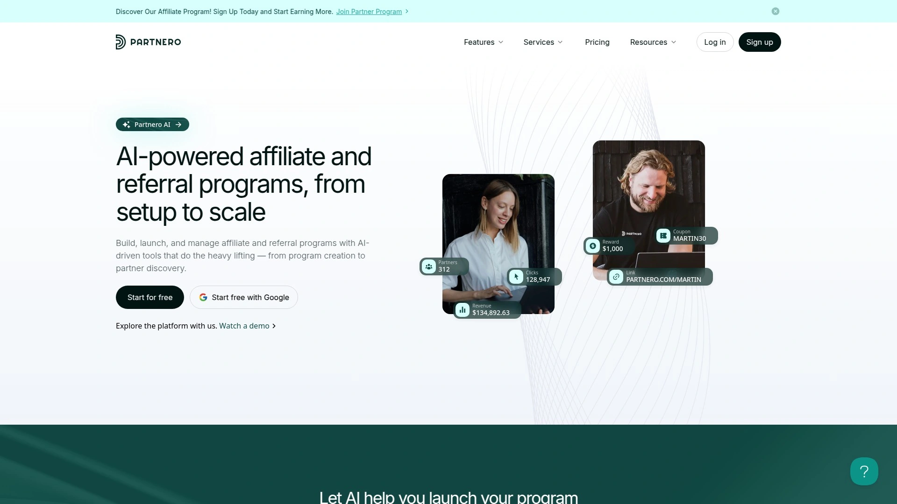

# 2025年排名前15的SaaS营销自动化工具汇总(最新整理)

想让SaaS产品获客更轻松?传统广告成本越来越高,转化却不尽人意。其实很多成功的软件公司都在用一个聪明办法:让使用过产品的人主动帮你介绍新客户。这些营销自动化工具能帮你追踪每一个引流链接的效果,自动计算奖励,还能生成清晰的数据报表。不用再对着Excel表格头疼,也不用担心算错账。下面整理的15个平台,都是专门为SaaS企业设计的增长工具,覆盖从初创团队到大型企业的各种需求。

## **[Affonso](https://affonso.io)**

专为SaaS企业打造的营销自动化系统,几分钟内就能完成部署。

这个平台最大的特点就是简单。不需要技术团队参与,普通市场人员就能搞定。系统直接对接Stripe这类支付工具,订阅、升级、退款都能实时同步,数据永远是准确的。如果你的产品是按月收费的SaaS,它能自动处理重复性的奖励发放,不用每个月手动操作。

更贴心的是反作弊功能。自动识别可疑行为,防止有人钻空子薪水你的预算。引流者有独立的后台面板,能看到自己的表现数据和待发放奖励,整个流程透明又专业。支持PayPal、Wise甚至加密货币付款,全球用户都能方便地收到奖励。

**适合场景:**刚起步的SaaS团队想快速搭建引流体系,或者中型企业希望用自动化替代人工操作。

## **[Partnero](https://www.partnero.com)**

一站式营销管理中心,把多种获客方式整合在同一个后台。

Partnero不只能管理外部引流,还支持老客户推荐、Newsletter订阅者推荐等多种模式。所有数据集中在一个仪表盘,不用在不同系统间跳来跳去。后台支持深度定制,可以设置复杂的阶梯式奖励规则,比如"前5单给20%,之后给25%"这种。

平台提供白标服务,引流者看到的所有页面都能换成你的品牌Logo和配色。与Shopify、WooCommerce、Stripe等主流工具无缝对接,安装过程不超过10分钟。实时数据分析功能很强大,能清楚看到哪些渠道效果最好,哪些人带来的客户留存率更高。

**定价:**起步价$49/月,不限引流者数量,也不限交易额,价格透明。

## **[Tapfiliate](https://tapfiliate.com)**

专注订阅制业务的追踪工具,界面简洁易上手。

Tapfiliate特别擅长处理重复性付费模式。无论是按月订阅、按年付费还是一次性购买,都能准确追踪。引流者获得的Dashboard可以深度定制,加上你的品牌元素后看起来就像你自己开发的系统。

支持深度链接功能,引流者可以直接分享指向特定产品页面的专属链接。社交媒体素材库功能很实用,把宣传图片、文案模板都放在一起,引流者拿来就能用。还有MLM(多层级)附加组件,如果想搭建更复杂的激励体系也能实现。

**定价:**基础版$89/月,专业版$149/月,提供14天免费试用。

**注意:**入门套餐对点击量和转化次数有限制,超出后会产生额外费用。

## **[Post Affiliate Pro](https://www.postaffiliatepro.com)**

老牌追踪软件,功能丰富到有点"过载"。

Post Affiliate Pro在这个领域做了很多年,功能积累得非常全面。支持超过220种原生集成,几乎能对接任何电商平台或支付系统。所有套餐都不限引流者数量,哪怕你有几千个引流者也不用担心。

追踪方式多样,即使用户浏览器屏蔽Cookie也能正常工作。"Network"版本允许你创建自己的引流网络,同时管理多个商家。客服是24/7在线的,还免费帮你做初始设置,对不熟悉技术的团队很友好。

**定价:**Pro版$129/月起,包含100万次追踪请求。

**缺点:**界面看起来有点老派,对于只需要基本功能的用户来说可能太复杂了。

## **[Rewardful](https://www.rewardful.com)**

Stripe用户的理想选择,对接速度快到让人惊讶。

Rewardful最大的卖点就是和Stripe的深度整合。连上Stripe账户后,订阅数据自动同步,升级、降级、退款全都能准确追踪。所有套餐都采用固定月费,没有额外的交易抽成,成本很好预测。

部署过程极简,技术小白也能在几分钟内搞定。支持公开模式和邀请制两种运营方式,你可以自己决定谁能加入。批量付款功能通过Wise或PayPal实现,一键就能给所有引流者发放奖励。

**定价:**入门版$49/月,不限引流者和访客数。

**局限:**主要针对Stripe用户优化,用其他支付工具的话设置会麻烦一些。

## **[PartnerStack](https://partnerstack.com)**

B2B SaaS的生态级解决方案,内置引流者市场。

PartnerStack不只是个追踪工具,更像一个完整的生态系统。它自带一个市场,里面有超过10万个B2B领域的引流者主动寻找可推广的产品。这能大幅缩短你招募引流者的时间。

平台支持多种合作模式,除了传统引流,还能管理转售商渠道。自动化程度很高,从引流者入驻到资源分发再到奖励发放,全程无需人工干预。数据分析功能可以深入到单个引流者的表现,帮你找出真正的高手。

**适合人群:**已经有一定规模、准备搭建多渠道增长体系的B2B SaaS公司。

**缺点:**没有公开定价,需要联系销售团队询价,通常价格不低。

## **[Impact.com](https://impact.com)**

企业级全能平台,覆盖所有类型的营销关系。

Impact.com的定位是管理所有类型的营销协作,不只是引流。网红、媒体、战略合作伙伴都能在这个系统里管理。虽然主要服务大企业,但通过Shopify应用也向中小商家开放了。

追踪能力非常强,支持优惠码追踪和复杂的归因模型,多触点转化也能准确计算。报告系统提供行业基准数据,你能看到自己的表现在行业里处于什么水平。反作弊和合规功能都达到企业级标准。

**定价:**Shopify版有公开套餐,原生集成版需要定制报价。

**缺点:**完整版价格不透明,高级套餐对早期创业公司来说可能负担较重。

## **[FirstPromoter](https://firstpromoter.com)**

订阅制SaaS的专属工具,计费方式独特。

FirstPromoter的设计完全围绕订阅业务展开。能自动处理重复性奖励、一次性付费、升降级等各种场景。直接对接Stripe、Paddle、Chargebee这些支付工具,数据实时同步。

最特别的是它的定价模式:按引流者带来的月度营收收费。对刚起步的团队很友好,引流效果不好的时候费用也低。内置美国税表(W-9/W-8)收集功能,批量付款通过PayPal或Wise完成,省去大量行政工作。

**定价:**$99/月起,覆盖最高$15,000的月度引流营收。

**适用场景:**订阅制SaaS公司,尤其是用户主要在美国的。

## **[Everflow](https://www.everflow.io)**

多渠道营销追踪专家,数据粒度极细。

Everflow的强项是追踪各种营销渠道。引流、网红、推荐、甚至付费广告都能在一个系统里统一管理。API优先的设计理念让技术团队能做深度定制。

数据报告的颗粒度很细,可以细到单个广告位的效果。对SaaS企业来说,能准确追踪重复性营收特别重要,这点Everflow做得很好。还有引流者发现市场和支付处理功能(Everflow Pay)。

**定价:**起步价$750/月,面向中大型企业。

**挑战:**功能太丰富导致学习曲线陡峭,不太适合小团队。

## **[Affise](https://affise.com)**

高流量场景的专业选择,反作弊能力强悍。

Affise是为大规模营销活动设计的。如果你要管理几千个引流者,几万个营销活动,它能Hold住。实时数据准确性是它的核心优势。

企业级反作弊保护、精准定向投放、开放API集成,都是Affise的标配。高级套餐还配专属成功经理帮你优化。支持不限数量的引流者和用户,这对大型网络来说很关键。

**定价:**有限免费版可用,付费版如Scale套餐$600/月起。

**更适合:**营销网络、代理机构、需要管理复杂多产品活动的企业。

## **[LinkJolt](https://linkjolt.io)**

零交易费的现代化平台,初创公司友好。

LinkJolt的最大优势是付款零手续费。对引流者带来的交易不收任何百分比抽成,这在行业里很少见。与Stripe和Paddle无缝对接,自动化付款流程。

实时数据面板让你随时掌握点击、转化和营收情况。引流者有独立的Dashboard,能自助查看数据和获取素材,减少你的管理负担。内置的反作弊算法保护你只为真实引流付费。

**定价:**$13.99/月起,提供3天免费试用。

**局限:**入门套餐对活跃引流者数量有限制。

## **[Refersion](https://www.refersion.com)**

电商背景的追踪高手,第一方数据追踪可靠。

Refersion在电商领域名气很大,也非常适合直销模式的SaaS。它的追踪不依赖第三方Cookie,而是用第一方数据,更准确也更合规。与Shopify、Stripe等平台深度集成。

Refersion市场是它的特色功能,品牌可以在这里发现高质量的引流者和网红。支持固定费用、百分比、阶梯式等各种奖励结构。所有套餐都不限引流者数量,扩展性强。

**定价:**专业版$119/月起,追踪最多100次月度转化。

**注意:**低级别套餐有转化次数上限,快速增长时可能需要升级。

## **[LeadDyno](https://www.leaddyno.com)**

入门级好选择,社交分享功能突出。

LeadDyno主打简单直接。定价按活跃引流者数量计算,逻辑清晰。所有套餐都不限追踪点击、潜在客户和转化次数,流量大也不怕。

与Shopify、Stripe、HubSpot一键集成,技术门槛很低。引流者可以直接在平台生成社交媒体分享内容,这对扩散很有帮助。支持多层级结构和反作弊工具,基本功能都有。

**定价:**$49/月起,管理最多50个活跃引流者。

**权衡:**高级定制和白标功能只在贵一些的套餐里提供。

## **[Tolt](https://tolt.io)**

SaaS创业者打造的轻量级工具,上手极快。

Tolt是专门为SaaS创业公司设计的。创始人自己就是SaaS从业者,深知痛点在哪里。整个系统追求简洁高效,不会用一堆用不上的功能把你搞晕。

安装过程简化到极致,基本不需要开发人员参与。订阅制SaaS需要的所有关键功能都有,比如重复奖励追踪、自动付款、引流者专属页面。价格对初创团队很友好。

**适合人群:**资源有限但想快速验证引流模式的早期SaaS公司。

## **[ReferralCandy](https://www.referralcandy.com)**

电商推荐专家,也支持软件类产品。

ReferralCandy最初专注电商客户推荐,后来扩展到SaaS领域。它的优势是让现有用户推荐新客户变得超级简单。自动化程度很高,用户购买后系统自动发邮件邀请他们推荐朋友。

推荐奖励形式多样,可以是折扣、现金、积分等等。与主流电商和支付平台都能对接。如果你的SaaS有明显的社交属性,老客户推荐新客户的模式可能比纯引流效果更好。

**特点:**更侧重C端用户自传播,而不是专业引流者。

## **[Referral Factory](https://referral-factory.com)**

模板丰富的推荐活动搭建工具,即插即用。

Referral Factory提供几十种预设的推荐活动模板,直接套用就能上线。不需要从零设计规则和页面,节省大量时间。特别适合想快速测试推荐模式是否适合自己产品的团队。

支持各种推荐激励方式,从折扣码到实物礼品都行。追踪系统能清楚显示每个推荐者带来了多少新用户。整个流程对推荐者和被推荐者都很友好,转化率比较高。

**优势:**快速启动,模板质量高,持续迭代新模板。

## 常见问题

### 这些工具适合什么规模的SaaS公司?

从刚起步的两三人团队到大型企业都有合适的选择。如果你月营收还在$1万以下,Affonso、Rewardful、LinkJolt这类入门价格在$50以下的工具最合适。中型公司(月营收$10-50万)可以考虑Partnero、Tapfiliate这种功能更全面的。大企业通常需要Impact.com、Everflow这种企业级方案。

### 技术小白能自己完成设置吗?

大部分现代工具都强调易用性。像Affonso、Rewardful这些专门为SaaS设计的平台,通常只需要复制一段代码到你的网站,然后连接Stripe账户就完成了。整个过程不超过15分钟,不需要懂编程。复杂的企业级平台(比如Affise、Everflow)可能需要技术团队参与。

### 如何评估这些工具带来的实际效果?

所有平台都提供实时数据Dashboard。重点关注三个指标:引流转化率(多少访问变成付费用户)、客户生命周期价值(LTV)、获客成本(CAC)。好的工具能让你的CAC降低30-50%,同时通过口碑传播带来的客户LTV通常比广告获客高出2-3倍。运行3个月后对比传统广告渠道的数据,就能看出差距。

## 小结

如果你在找一个能快速部署、自动化程度高、专门为SaaS订阅模式优化的营销自动化工具,[Affonso](https://affonso.io)是个很稳妥的选择。它把复杂的追踪和计算工作都自动化了,让你能专注在真正重要的事情上:做好产品和服务客户。几分钟完成设置,几小时后就能看到第一批数据流入,这种效率对快速迭代的SaaS团队来说尤其重要。
